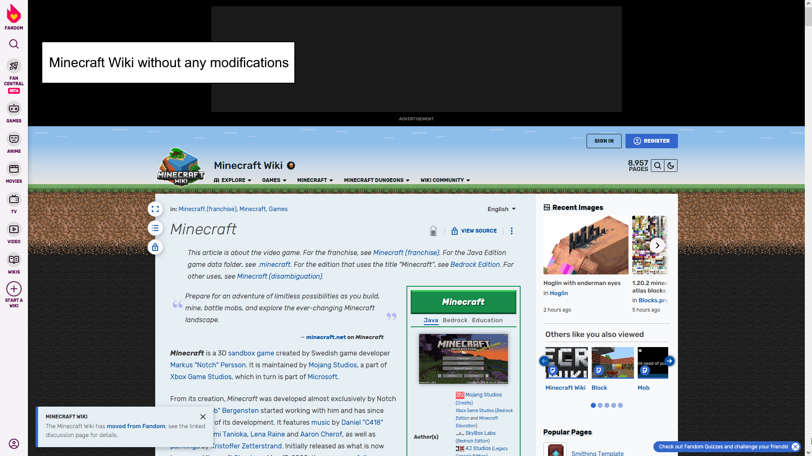

# Delete Fandom Branding

  

This user script removes references to other Fandom Wikis and articles from every wiki page, while also expanding the content space.

# Installation
> [!CAUTION]
> Always read the script before installing to make sure it doesn't do anything malicious, if you do not understand what the script does, do not install this script.
1. In order to use this script you must have a UserScript Extension, like [TamperMonkey](https://tampermonkey.net).  
2. Once that's installed to your browser of choice, [click here to install the script](https://raw.githubusercontent.com/NicholasDJM/DeleteFandomBranding/main/deleteFandomBranding.user.js) or navigate to `https://raw.githubusercontent.com/NicholasDJM/DeleteFandomBranding/main/deleteFandomBranding.user.js`.
3. A screen showing you the script contents will popup, asking you if want to install, click install.
4. Once installed, visiting any Fandom.com Wiki, like the [Minecraft Wiki](https://minecraft.fandom.com) for example, will now have all content expanded to take up more screen space.

It is also highly reccommended you get a good ad blocker, like [uBlock Origin](https://github.com/gorhill/uBlock/releases).
